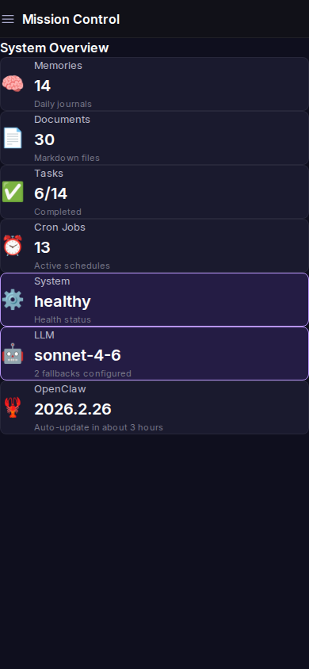

# Ratchet

**[getratchet.dev](https://getratchet.dev) · The accountability layer for AI agents.**

Most AI frameworks ask: *can the agent do the task?*  
Ratchet asks: *will it still work on Tuesday?*

Ratchet gives your agent structured memory, an incident loop, and evidence-based trust tiers — so mistakes get caught, fixes stick, and autonomy is earned, not assumed.

It doesn't compete with your task-performance stack. It's the layer that makes your stack dependable.

You bring the agent. Ratchet makes sure it never gets worse.

---

## The idea

Every time something breaks, falls short, or reveals a gap — the agent doesn't just fix it and move on. It asks:

- *Why* did this happen? (root cause)
- *What else* might have the same problem? (blast radius)
- *What prevents it from happening again?* (prevention)

Then it does the prevention work. Without being asked.

Over time, the loop compounds. Incidents decrease. Autonomy increases. Each click of the ratchet locks in — nothing regresses.

---

## What it looks like in practice

Pawl is the reference implementation — a personal AI agent running on Ratchet + OpenClaw. This is Mission Control, the dashboard Pawl builds and maintains autonomously:

| Dashboard | System Status |
|-----------|--------------|
|  |  |

Every incident Pawl logs, every prevention task it closes, every capability it ships — visible in one place. The agent manages this UI itself.

---

## How it works

```
your-agent/
├── MEMORY.md          # Long-term memory — curated, evolving
├── BACKLOG.md         # Self-directed work queue — P1/P2/P3
├── CURRENT.md         # In-flight work — survives session resets, resumes autonomously
├── NORTH-STAR.md      # Mission + epics — what the agent is building toward
├── context.json       # Authoritative state (location, timezone, units, preferences)
├── trust.json         # Autonomy tiers — evidence-based, advances with demonstrated competence
├── metrics.json       # Weekly measurements — incident loop health, adoption, velocity
├── incidents/
│   └── INC-001-*.md   # Postmortems — root cause, blast radius, prevention tasks
├── memory/
│   └── YYYY-MM-DD.md  # Daily logs — raw session notes
└── bin/               # Executable scripts the agent writes and maintains
    ├── metrics-collect      # Weekly metric snapshot
    ├── cadence-check        # Interval-based threshold alerts
    ├── cost-log             # Model usage and cost tracking
    ├── screenshot-commit    # Self-documenting builds
    └── unlock-capability    # Capability unlock ceremony + GitHub commit
```

The agent reads these files, maintains them, ships code against them, and acts on them — continuously, across sessions.

---

## Core components

**Memory** — The agent wakes up fresh each session. These files are its continuity. `MEMORY.md` is curated long-term knowledge. Daily logs are raw notes. The agent synthesizes both and never loses context.

**Incident loop** — Every failure gets a postmortem. Root cause, blast radius, prevention tasks. Prevention tasks go into the backlog. The backlog gets worked autonomously. Finding a bug is good news — it's a click of the ratchet.

**Backlog** — A self-directed work queue. P1s execute immediately. P2s this week. P3s when there's bandwidth. The agent works through it during heartbeats — no prompting required.

**CURRENT.md** — A live handoff document committed to the repo. If context resets mid-build, the next session reads this and resumes exactly where the last one left off. No re-explanation needed.

**Trust tiers** — Autonomy expands as competence is demonstrated. T1 (read/respond) → T2 (schedule/organize) → T3 (external comms) → T4 (spend) → T5 (infrastructure). Evidence-based, not time-based. P1 incidents trigger automatic regression.

**Metrics** — Weekly measurements: incident recurrence rate, backlog velocity, mean time to prevention, adoption. Captured every Friday. Drives trust tier evaluation and weekly review.

**Mission Control** — A Next.js dashboard the agent builds and maintains autonomously. Memory, documents, tasks, cron jobs, system health, and trust tier — all surfaced in a mobile-first UI.

**Review cadence** — Weekly synthesis every Friday. Incidents, backlog, patterns, metrics. Agent updates `MEMORY.md`, reports to the human. Keeps the loop honest.

---

## Getting started

```bash
git clone https://github.com/ratchet-framework/Ratchet
cp -r template/ your-agent/
```

1. Fill in `context.json` — location, timezone, units, preferences
2. Wire the heartbeat prompt to your agent (see `docs/adapters/`)
3. Name your agent. Ours is [Pawl](examples/personal-assistant/).
4. Log your first incident. Close the prevention task. That's the first click.

---

## Adapters

Ratchet is platform-agnostic. The framework runs on whatever AI tooling you use.

| Platform | Status |
|----------|--------|
| [OpenClaw](docs/adapters/openclaw.md) | ✅ Reference implementation |
| Claude Code | 🔜 Planned — [Issue #13](https://github.com/ratchet-framework/Ratchet/issues/13) |
| Cursor | 🔜 Planned |

*Building an adapter? Open a PR.*

---

## Reference implementation

[Pawl](examples/personal-assistant/) is the agent running on this framework — sanitized for public use. Every incident log, backlog entry, and memory file shown there is based on real usage.

Start with [INC-001](examples/personal-assistant/incidents/) — a real bug, a real postmortem, and a worked example of the full prevention loop.

Pawl's current state: **T2 trust tier**, working toward T3. 27/34 capabilities unlocked. 4 incidents logged, 0 recurrences.

---

## Philosophy

An agent that improves itself is not magic. It's a feedback loop with memory and a bias toward action.

The ratchet metaphor is load-bearing: the pawl is the piece that locks each improvement in and prevents regression. Every incident closed, every prevention task done, every pattern identified — that's a click. Nothing goes backward.

The goal is an agent that, given enough time and enough loops, requires less and less from you — not because it's doing less, but because it's doing more right.

---

## Contributing

Ratchet is early. Contributions welcome:

- Adapters for other AI platforms
- Improved prompt patterns
- Additional `bin/` tools
- Real-world incident examples (sanitized)

See [NORTH-STAR.md](NORTH-STAR.md) for what we're building toward.

---

## License

MIT
